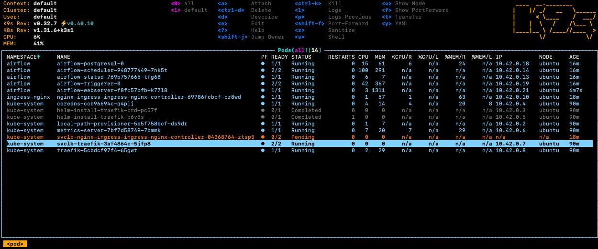

# Vagrant 를 활용한 ollama 로컬 환경 구축
## 1. Vagrant install
```bash
brew install vagrant
```
## 2. Vagrant 초기화
```bash
vagrant init
```
## 3. Vagrantfile 작성
```text
Vagrant.configure("2") do |config|
  config.vm.synced_folder ".", "/vagrant"
  config.disksize.size = '50GB'

  config.vm.provider :virtualbox do |vb|
    vb.name = "airflow-in-k3s"
  end

  config.vm.define :ubuntu do |host|
    host.vm.box = "net9/ubuntu-24.04-arm64"
    host.vm.box_version = "1.1"
    host.vm.hostname = "ubuntu"
    host.vm.network :private_network, ip: "192.168.5.102"
    host.vm.network :forwarded_port, guest: 8080, host:8080
    host.vm.network :forwarded_port, guest: 443, host:443
    host.vm.network :forwarded_port, guest: 80, host:80
    host.vm.provision :shell, path: "./.sh/init_script.sh"
    host.vm.provider "virtualbox" do |vb|
      vb.memory = 8192
      vb.cpus = 4
    end
  end
end
```
## 4. init script 작성
```shell
#!/bin/bash
set -e

whoami
pwd
apt-get update
apt-get install net-tools -y
apt-get install apt-transport-https ca-certificates curl gnupg-agent software-properties-common -y

# Docker & Docker Compose 설치
curl -fsSL https://download.docker.com/linux/ubuntu/gpg | sudo apt-key add -
add-apt-repository "deb [arch=amd64] https://download.docker.com/linux/ubuntu $(lsb_release -cs) stable"
apt-get update
apt-get install docker-ce docker-ce-cli containerd.io -y
wget https://github.com/docker/compose/releases/download/v2.34.0/docker-compose-linux-$(uname -m)
mv docker-compose-linux-aarch64 /usr/bin/docker-compose
chmod +x /usr/bin/docker-compose
chmod o+rw /var/run/docker.sock

# k3s install
curl -sfL https://get.k3s.io | sh -
curl -fsSL -o get_helm.sh https://raw.githubusercontent.com/helm/helm/main/scripts/get-helm-3
chmod 700 get_helm.sh
./get_helm.sh
chmod 666 /etc/rancher/k3s/k3s.yaml
su - vagrant -c 'echo "export KUBECONFIG=/etc/rancher/k3s/k3s.yaml" >> ~/.bashrc; source ~/.bashrc'

# k9s install
K9S_VERSION=0.32.7
KERNEL=$(uname -s | tr A-Z a-z)
ARCH=$(uname -m)

if [ ${ARCH} == "arm64" ]; then
    ARCH_ALT=arm64
fi
if [ ${ARCH} == "aarch64" ]; then
    ARCH_ALT=arm64
fi
if [ ${ARCH} == "x86_64" ]; then
    ARCH_ALT=amd64
fi

curl --silent --location "https://github.com/derailed/k9s/releases/download/v${K9S_VERSION}/k9s_Linux_${ARCH_ALT}.tar.gz" | tar xz -C /tmp
cp /tmp/k9s /usr/local/bin
cp /tmp/k9s /usr/bin

# Airflow install
mkdir -p /opt/app/airflow
cp -v /vagrant/values.yaml /opt/app/airflow/
chown -R vagrant: /opt/app/airflow
echo "127.0.0.1 airflow.local" >> /etc/hosts
```
## 5. Vagrant up
```bash
vagrant up
```
## 6. Vagrant 환경 접속
```bash
vagrant ssh
```
## 7. Vagrant stop
```bash
vagrant halt
```
## 8. Vagrant 삭제
```bash
vagrant destroy
```
## 9. Disk 증설
```bash
sudo su - 

# Disk 용량 증설
parted /dev/sda print
parted /dev/sda resizepart 3 100%
pvresize /dev/sda3
vgdisplay
lvdisplay
lvextend -l +100%FREE /dev/ubuntu-vg/ubuntu-lv
resize2fs /dev/ubuntu-vg/ubuntu-lv
```

`Fix/Ingnore?` 나올 시 `Fix` 입력 후 `Enter`
## 10. Nginx ingress controller install by helm
```bash
# Nginx ingress install
helm repo add ingress-nginx https://kubernetes.github.io/ingress-nginx
helm repo update

helm install nginx-ingress ingress-nginx/ingress-nginx \
  --namespace ingress-nginx \
  --create-namespace
```
## 11. Airflow helm values 작성
```yaml
executor: KubernetesExecutor

airflow:
  image:
    repository: apache/airflow
    tag: 2.9.3

config:
  core:
    default_timezone: 'Asia/Seoul'
    dags_are_paused_at_creation: 'False'
    dagbag_import_timeout: 60
    test_connection: 'Enalbed'
    load_examples: 'False'
  logging:
    logging_level: 'INFO'
    fab_logging_level: 'INFO'
  webserver:
    default_ui_timezone: 'Asia/Seoul'
    default_wrap: 'True'
    enable_proxy_fix: 'True'
  scheduler:
    enable_health_check: 'True'

ingress:
  enabled: true
  ingressClassName: nginx
  web:
    path: /
    hosts:
      - airflow.local
  extraPaths:
    - path: /
      pathType: Prefix
      backend:
        service:
          name: airflow-web
          port:
            number: 8080

postgresql:
  enabled: true

redis:
  enabled: true
```
## 12. Airflow install by helm
```bash

helm repo add apache-airflow https://airflow.apache.org

helm upgrade --install -f /opt/app/airflow/values.yaml airflow apache-airflow/airflow \
  --namespace airflow \
  --create-namespace
```
## 13. k9s를 이용하여 확인
```bash
k9s
```
