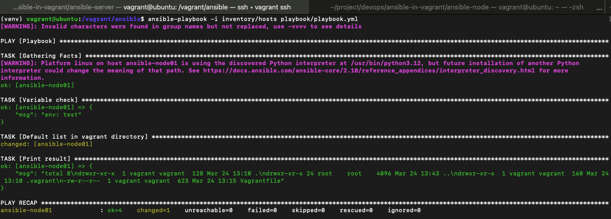

# Vagrant 를 활용한 ollama 로컬 환경 구축
## 1. Vagrant install
```bash
brew install vagrant
```
## 2. Vagrant 초기화
```bash
vagrant init
```
## 3. Vagrantfile 작성
Ansible server:
```text
Vagrant.configure("2") do |config|
  config.vm.synced_folder ".", "/vagrant"
  config.disksize.size = '50GB'

  config.vm.provider :virtualbox do |vb|
    vb.name = "ansible-server-in-vagrant"
  end

  config.vm.define :ubuntu do |host|
    host.vm.box = "net9/ubuntu-24.04-arm64"
    host.vm.box_version = "1.1"
    host.vm.hostname = "ubuntu"
    host.vm.network :private_network, ip: "192.168.5.103"
    host.vm.network :forwarded_port, guest: 22, host:50022
    host.vm.provision :shell, path: "../.sh/init_script.sh"
    host.vm.provider "virtualbox" do |vb|
      vb.memory = 8192
      vb.cpus = 4
    end
  end
end
```
Ansible node:
```text
Vagrant.configure("2") do |config|
  config.vm.synced_folder ".", "/vagrant"
  config.disksize.size = '50GB'

  config.vm.provider :virtualbox do |vb|
    vb.name = "ansible-server-in-vagrant"
  end

  config.vm.define :ubuntu do |host|
    host.vm.box = "net9/ubuntu-24.04-arm64"
    host.vm.box_version = "1.1"
    host.vm.hostname = "ubuntu"
    host.vm.network :private_network, ip: "192.168.5.104"
    host.vm.network :forwarded_port, guest: 22, host:60022
    host.vm.provision :shell, path: "../.sh/init_script.sh"
    host.vm.provider "virtualbox" do |vb|
      vb.memory = 8192
      vb.cpus = 4
    end
  end
end
```
## 4. init script 작성
```shell
#!/bin/bash
set -e

whoami
pwd
apt-get update
apt-get install net-tools -y
apt-get install apt-transport-https ca-certificates curl gnupg-agent software-properties-common python3.12-* -y

# Docker & Docker Compose 설치
curl -fsSL https://download.docker.com/linux/ubuntu/gpg | sudo apt-key add -
add-apt-repository "deb [arch=amd64] https://download.docker.com/linux/ubuntu $(lsb_release -cs) stable"
apt-get update
apt-get install docker-ce docker-ce-cli containerd.io -y
wget https://github.com/docker/compose/releases/download/v2.34.0/docker-compose-linux-$(uname -m)
mv docker-compose-linux-aarch64 /usr/bin/docker-compose
chmod +x /usr/bin/docker-compose
chmod o+rw /var/run/docker.sock
```
## 5. Vagrant up
```bash
vagrant up
```
## 6. Vagrant 환경 접속
```bash
vagrant ssh
```
## 7. Vagrant stop
```bash
vagrant halt
```
## 8. Vagrant 삭제
```bash
vagrant destroy
```
## 9. Disk 증설
```bash
sudo su - 

# Disk 용량 증설
parted /dev/sda print
parted /dev/sda resizepart 3 100%
pvresize /dev/sda3
vgdisplay
lvdisplay
lvextend -l +100%FREE /dev/ubuntu-vg/ubuntu-lv
resize2fs /dev/ubuntu-vg/ubuntu-lv
```

`Fix/Ingnore?` 나올 시 `Fix` 입력 후 `Enter`
## 10. SSH Public key 설정
```bash
ssh-keygen -t rsa -P '' -f ~/.ssh/id_rsa
cat ~/.ssh/id_rsa.pub >> ~/.ssh/authorized_keys
cd .ssh/
chmod 600 *

ssh-copy-id -i ~/.ssh/id_rsa.pub vagrant@192.168.5.104
# Password: vagrant
```
## 11. Ansible install
```bash
cd /vagrant/ansible
python3.12 -m venv venv
pip install ansible
```
## 12. Ansible config 생성
```bash
ansible-config init --diabled > ansible.cfg
```
## 13. Ansible hosts 작성
경로: `/vagrant/ansible/inventory/hosts`
```yaml
ansible-node:
  hosts:
    ansible-node01: 
      ansible_host: 192.168.5.104
      ansible_user: vagrant
```
## 14. Ansible group variable 작성
경로: `/vagrant/ansible/inventory/group_vars/ansible-node.yml`
```yaml
env: test
```
## 15. Ansible playbook 작성
경로: `/vagrant/ansible/playbook/playbook.yml`
```yaml
---
- name: Playbook
  hosts: ansible-node
  remote_user: vagrant

  tasks:
    - name: Variable check
      debug:
        msg: "env: {{ env }}"

    - name: Default list in vagrant directory
      shell: |
        ls -al /vagrant
      register: list
  
    - name: Print result
      debug:
        msg: "{{ list.stdout }}"
```
## 16. Ansible playbook 실행
```bash
cd /vagrant/ansible
source venv/bin/activate

ansible-playbook -i inventory/hosts playbook/playbook.yml
```
